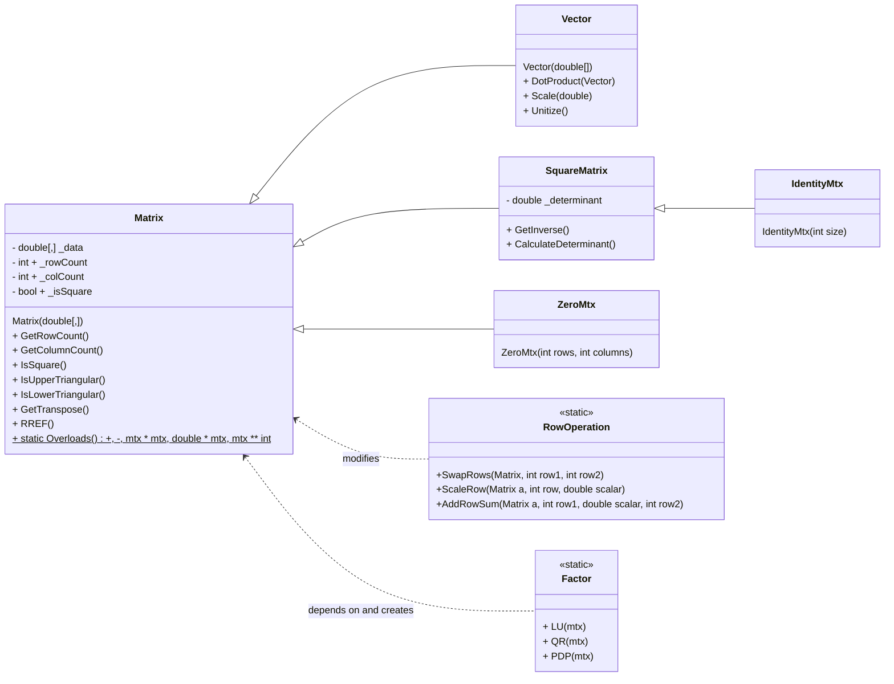
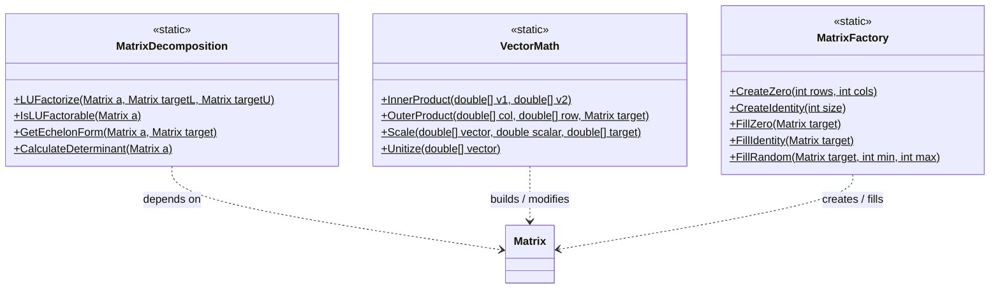

# Matrices

This program is designed to be a general purpose matrix calculator. It allows
the user to input multiple matrices and perform various basic operations with
them. Functionalities will include:

1. Determinant
1. Transpose
1. Inverse
1. LU, QR, and PDP Decomposition
1. Matrix addition and multiplication
1. Matrix-Vector multiplication
1. The RREF of a matrix
1. Pseudo-inverse for non-square matrices

## Class Diagram

