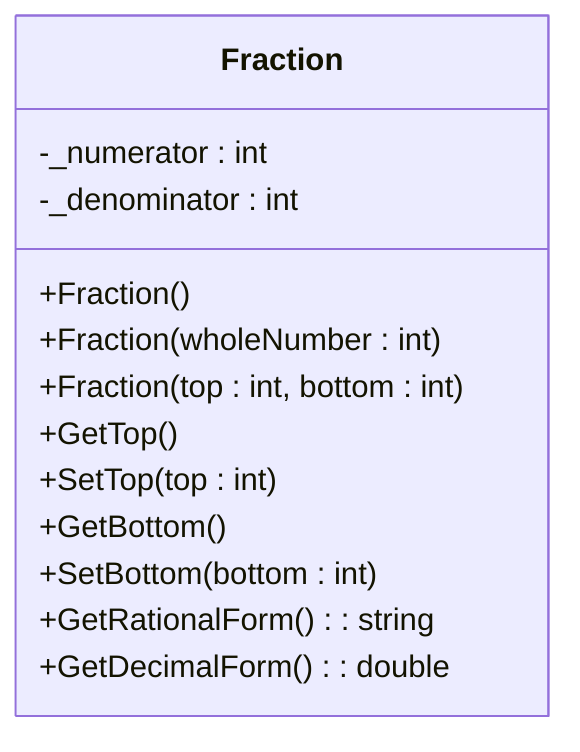

# Learn03

## Design

### Fraction Class

```mermaid
classDiagram
    class Fraction {
        -_numerator : int
        -_denominator : int
        +Fraction()
        +Fraction(wholeNumber : int)
        +Fraction(top : int, bottom : int)
        +GetTop()
        +SetTop(top : int)
        +GetBottom()
        +SetBottom(bottom : int)
        +GetRationalForm() : string
        +GetDecimalForm() : double
    }
```

