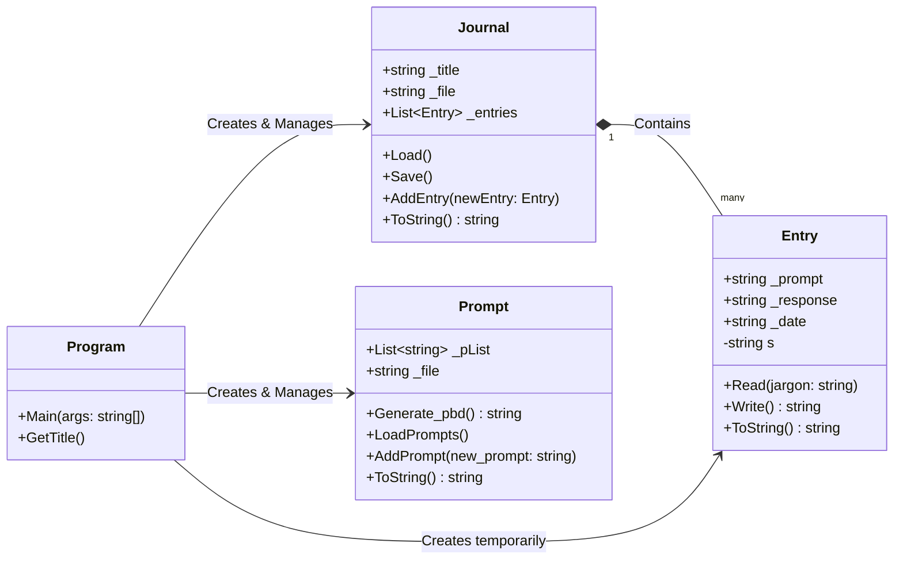

# Hello MarkDown World!
This is me finally dipping my toes into markdown, as it's going to be an 
important part of my work from here on out.

## Journal Program Flowchart
This is for my own sake, I wanted to see how I could create my own flowcharts in
VS Code

