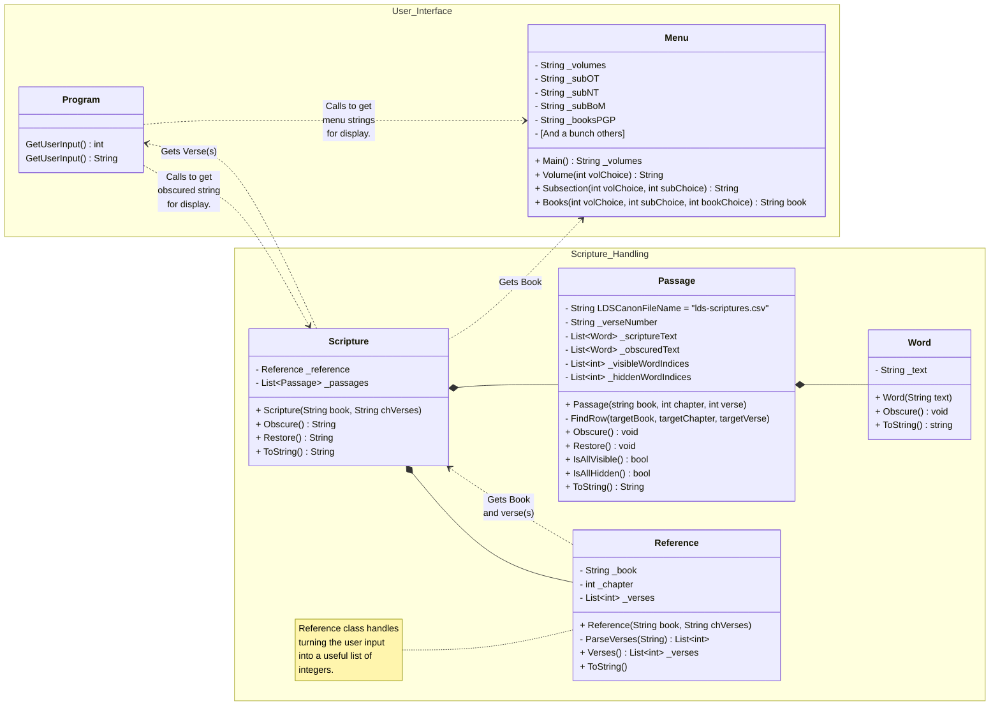
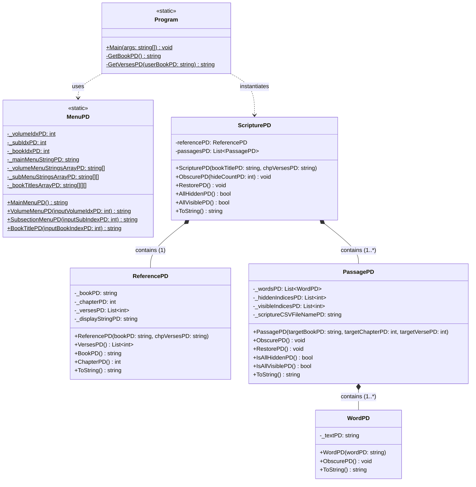
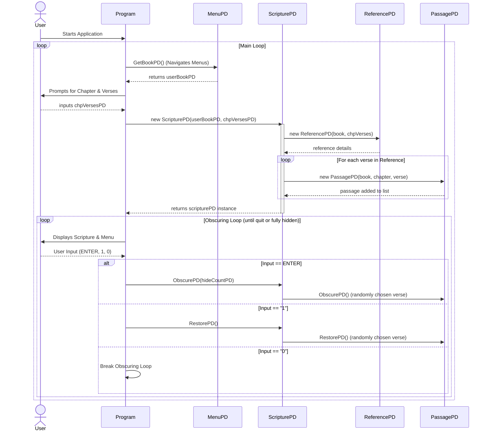
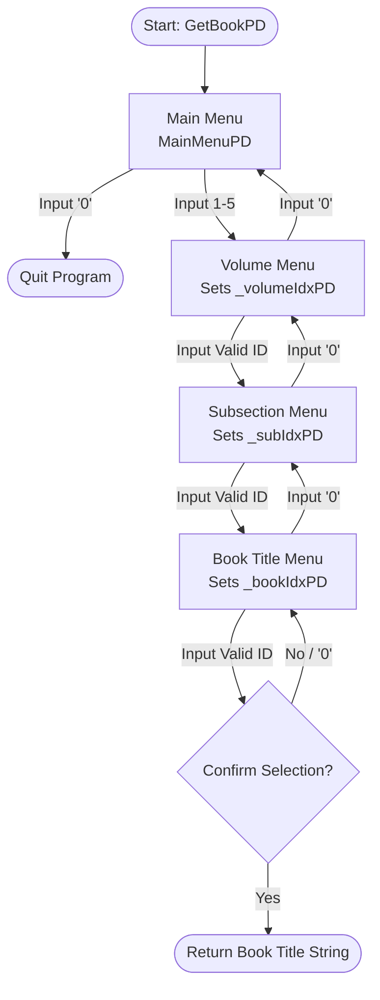
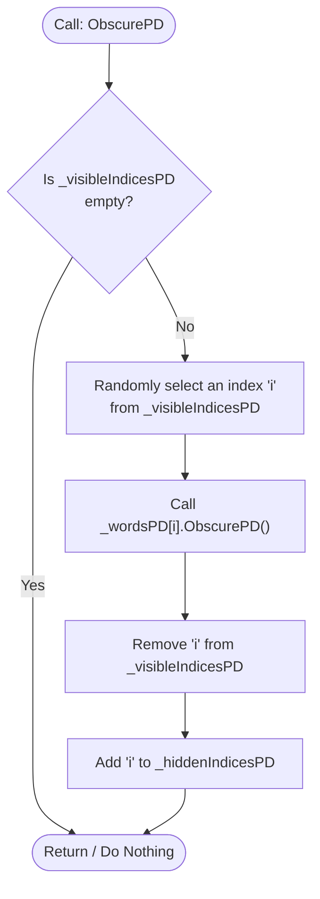

# README

## Assignment Details

Here are the pages associated with this assignment:

[Design Activity](https://byui-cse.github.io/cse210-course-2023/unit03/design.html)

[Program Requirements](https://byui-cse.github.io/cse210-course-2023/unit03/develop.html)

## Design

### Class Breakdown

#### Required Classes

- Scripture

  - Creates and manages the Reference and Passage classes

  - Responsible for formatting and providing strings for the program to display

- Reference

  - Contains information about the Book, Chapter, and Verse of a scripture, and
    is capable of accomodating scripture references of more than one verse

  - Responsible for parsing a user-input string of verses into a list of
    integers (e.g. `"12-15, 20-22, 24"` to `[12, 13, 14, 15, 20, 21, 22, 24]`)

- Word

  - Contains literally just one word

  - Responsible for hiding that word

#### My Classes

- Menu

  - Allows the user to select the book from which they would like to memorize a
    scripture

  - Contains multiple raw string literals of each menu layer
  
  - Responsible for returning the correct menu screen given an integer input

- Passage

  - There's meant to be one verse per passage object.

  - Composed of a list of Word objects

  - Responsible for keeping track of which words have been hidden and which are
    still visible

  - Responsible for telling words when to obscure themselves

  - Responsible for restoring words to be visible

  - Responsible for formatting display strings to be less than about 40-50
    characters wide

### Class Diagram

My class diagram for this program that I used to help me write it.

#### AI Diagrams (For Fun!)

AI's class diagram after having it look at my completed project.

Sequence diagram

Menu Flowchart

Activity Diagram for the Obscure function

### IPO Table

| Input | Processing | Output |
| --- | --- | --- |
| From `Menu` class | Call display methods to return menu Strings and write to console  Get user input to move into deeper levels  (E.g. New Testament -> Romans -> Chapter number -> verse number(s)) | Display scripture selection menu with quit program option |
| (While in the main menu) `0` | Clear console, end loop | Terminate Program |
| Scripture Selection (Book, Chapter, Verses) | 1. Open CSV file  2. Return Scripture text  3. Format Strings for display  *Bonus Processing*  Count # of characters in each word as they come into the list.   As soon as a length of 30-40 characters has been exceeded, insert a linebreak into the String. | Display chosen verses as numbered paragraphs (as they appear in the scriptures) with the correct reference  *Bonus: Force paragraphs to stay under 30-40 characters wide without splitting in the middle of words* |
| `Enter` | `Console.WriteLine(<Scripture>.Obscure())` 1. Isolate words within the scripture text String (e.g. into a list)  2. Filter out already blanked-out words  3. Pick 3 unblanked indices at random  4. Blank those words, and reconstruct the String  5. Return formatted String (so it can be handed over to `Console.WriteLine()`| Show the same verse(s) with a few words replaced with blanks at random |
| `0` (or `Enter` if all words have been blanked out) | Clear console window, loop program | Return to scripture selection/quit out menu |
| *Optional Ideas:* | | |
| "Got it" or  "Didn't get it" | If (Got it) {`Word.HideWords()`}  Else If (Didn't Get it) {`Word.RestoreBlank()`  1. Pick a random blanked out spot from currently displayed String  2. Reference original scripture text to find the word to restore  3. Update display String  4. Call `Console.WriteLine(Word)` } | Proceed; remove 3 more words   Try again; restore 1 blanked out word |

### Menu Navigation

(for my own (in)sanity)

```mermaid
flowchart LR
    Quit
    main["`<u>Main Menu</u>
      Choose a volume (Enter a number 0-5):
      0. (Quit)
      1. Old Testament
      2. New Testament
      3. Book of Mormon
      4. Pearl of Great Price
      5. Doctrine and Covenants
    `"]
    Quit ~~~ main
    main -->|0|Quit
    main -->|1|OT
    main -->|2|NT
    main -->|3|BM
    main -->|4|PP
    main -->|5|DC

    OT -->|1|Law
    OT -->|2|History
    OT -->|3|Poetry
    OT -->|4|Proph1
    OT -->|5|Proph2

    NT -->|1|Gospels
    NT -->|2|Paul
    NT -->|3|Epistles

    BM -->|1|Small
    BM -->|2|Large

    Law -->|1|Genesis --> EC4[ENTER_CHAPTER]
    Law -->|2|Exodus --> EC4[ENTER_CHAPTER]
    Law -->|3|Leviticus --> EC4[ENTER_CHAPTER]
    Law -->|4|Numbers --> EC4[ENTER_CHAPTER]
    Law -->|5|Deuteronomy --> EC4[ENTER_CHAPTER]

    History --> |1|Joshua --> EC4[ENTER_CHAPTER]
    History --> |2|Judges --> EC4[ENTER_CHAPTER]
    History --> |3|Ruth --> EC4[ENTER_CHAPTER]
    History --> |4|1-Samuel --> EC4[ENTER_CHAPTER]
    History --> |5|2-Samuel --> EC4[ENTER_CHAPTER]
    History --> |6|1-Kings --> EC4[ENTER_CHAPTER]
    History --> |7|2-Kings --> EC4[ENTER_CHAPTER]
    History --> |8|1-Chronicles --> EC4[ENTER_CHAPTER]
    History --> |9|2-Chronicles --> EC4[ENTER_CHAPTER]
    History --> |10|Ezra --> EC4[ENTER_CHAPTER]
    History --> |11|Nehemiah --> EC4[ENTER_CHAPTER]
    History --> |12|Esther --> EC4[ENTER_CHAPTER]

    Poetry -->|1|Job --> EC4[ENTER_CHAPTER]
    Poetry -->|2|Psalms --> EC4[ENTER_CHAPTER]
    Poetry -->|3|Proverbs --> EC4[ENTER_CHAPTER]
    Poetry -->|4|Ecclesiastes --> EC4[ENTER_CHAPTER]
    Poetry -->|5|Song-of-Solomon --> EC4[ENTER_CHAPTER]

    Proph1 -->|1|Isaiah --> EC4[ENTER_CHAPTER]
    Proph1 -->|2|Jeremiah --> EC4[ENTER_CHAPTER]
    Proph1 -->|3|Lamentations --> EC4[ENTER_CHAPTER]
    Proph1 -->|4|Ezekiel --> EC4[ENTER_CHAPTER]
    Proph1 -->|5|Daniel --> EC4[ENTER_CHAPTER]
    Proph1 -->|6|Hosea --> EC4[ENTER_CHAPTER]
    Proph1 -->|7|Joel --> EC4[ENTER_CHAPTER]
    Proph1 -->|8|Amos --> EC4[ENTER_CHAPTER]
    Proph1 -->|9|Obadiah --> EC4[ENTER_CHAPTER]

    Proph2 -->|1|Jonah --> EC4[ENTER_CHAPTER]
    Proph2 -->|2|Micah --> EC4[ENTER_CHAPTER]
    Proph2 -->|3|Nahum --> EC4[ENTER_CHAPTER]
    Proph2 -->|4|Habakkuk --> EC4[ENTER_CHAPTER]
    Proph2 -->|5|Zephaniah --> EC4[ENTER_CHAPTER]
    Proph2 -->|6|Haggai --> EC4[ENTER_CHAPTER]
    Proph2 -->|7|Zechariah --> EC4[ENTER_CHAPTER]
    Proph2 -->|8|Malachi --> EC4[ENTER_CHAPTER]

    Gospels -->|1|Matthew --> EC4[ENTER_CHAPTER]
    Gospels -->|2|Mark --> EC4[ENTER_CHAPTER]
    Gospels -->|3|Luke --> EC4[ENTER_CHAPTER]
    Gospels -->|4|John --> EC4[ENTER_CHAPTER]
    Gospels -->|5|Acts --> EC4[ENTER_CHAPTER]

    Paul -->| 1|Romans --> EC4[ENTER_CHAPTER]
    Paul -->| 2|1-Corinthians --> EC4[ENTER_CHAPTER]
    Paul -->| 3|2-Corinthians --> EC4[ENTER_CHAPTER]
    Paul -->| 4|Galatians --> EC4[ENTER_CHAPTER]
    Paul -->| 5|Ephesians --> EC4[ENTER_CHAPTER]
    Paul -->| 6|Philippians --> EC4[ENTER_CHAPTER]
    Paul -->| 7|Colossians --> EC4[ENTER_CHAPTER]
    Paul -->| 8|1-Thessalonians --> EC4[ENTER_CHAPTER]
    Paul -->| 9|2-Thessalonians --> EC4[ENTER_CHAPTER]
    Paul -->|10|1-Timothy --> EC4[ENTER_CHAPTER]
    Paul -->|11|2-Timothy --> EC4[ENTER_CHAPTER]
    Paul -->|12|Titus --> EC4[ENTER_CHAPTER]
    Paul -->|13|Philemon --> EC4[ENTER_CHAPTER]
    Paul -->|14|Hebrews --> EC4[ENTER_CHAPTER]

    Epistles -->|1|James --> EC4[ENTER_CHAPTER]
    Epistles -->|2|1-Peter --> EC4[ENTER_CHAPTER]
    Epistles -->|3|2-Peter --> EC4[ENTER_CHAPTER]
    Epistles -->|4|1-John --> EC4[ENTER_CHAPTER]
    Epistles -->|5|2-John --> EC4[ENTER_CHAPTER]
    Epistles -->|6|3-John --> EC4[ENTER_CHAPTER]
    Epistles -->|7|Jude --> EC4[ENTER_CHAPTER]
    Epistles -->|8|Revelation --> EC4[ENTER_CHAPTER]

    Small -->|1|1-Nephi --> EC4[ENTER_CHAPTER]
    Small -->|2|2-Nephi --> EC4[ENTER_CHAPTER]
    Small -->|3|Jacob --> EC4[ENTER_CHAPTER]
    Small -->|4|Enos --> EC4[ENTER_CHAPTER]
    Small -->|5|Jarom --> EC4[ENTER_CHAPTER]
    Small -->|6|Omni --> EC4[ENTER_CHAPTER]

    Large -->|1|WoM --> EC4[ENTER_CHAPTER]
    Large -->|2|Mosiah --> EC4[ENTER_CHAPTER]
    Large -->|3|Alma --> EC4[ENTER_CHAPTER]
    Large -->|4|Helaman --> EC4[ENTER_CHAPTER]
    Large -->|5|3-Nephi --> EC4[ENTER_CHAPTER]
    Large -->|6|4-Nephi --> EC4[ENTER_CHAPTER]
    Large -->|7|Mormon --> EC4[ENTER_CHAPTER]
    Large -->|8|Ether --> EC4[ENTER_CHAPTER]
    Large -->|9|Moroni --> EC4[ENTER_CHAPTER]

    PP -->|1|Moses
    PP -->|2|Abraham
    PP -->|3|JST-Matthew
    PP -->|4|Joseph-Smith-History
    PP -->|5|Articles-of-Faith

    Moses & Abraham & JST-Matthew & Joseph-Smith-History & Articles-of-Faith --> EC3[ENTER_CHAPTER]
    OT["`<u>Old Testament</u>
    Choose a subsection:
      0. (Go Back)
      1. The Law
      2. History
      3. Poetry
      4. The Prophets (1/2)
      5. The Prophets (2/2)
    `"]

    NT["`<u>New Testament</u>
      0. (Go Back)
      1. The Gospels +
      2. Pauline Epistles
      3. General Epistles +
    `"]

    BM["`<u>Book of Mormon</u>
      0. (Go Back)
      1. Small Plates of Nephi
      2. Mormon's Abridgement   |
    `"]

    PP["`<u>Pearl of Great Price</u>
      0. (Go Back)
      1. Moses
      2. Abraham
      3. JST-Matthew
      4. Joseph Smith History
      5. Articles of Faith
    `"]

    DC[ENTER_CHAPTER]

    Law["`<u>The Law</u>
      0. (Go Back)
      1. Genesis
      2. Exodus
      3. Leviticus
      4. Numbers
      5. Deuteronomy
    `"]

    History["`<u>History</u>
       0. (Go Back)
       1. Joshua
       2. Judges
       3. Ruth
       4. 1 Samuel
       5. 2 Samuel
       6. 1 Kings
       7. 2 Kings
       8. 1 Chronicles
       9. 2 Chronicles
      10. Ezra
      11. Nehemiah
      12. Esther
    `"]

    Poetry["`<u>Poetry</u>
      0. (Go Back)
      1. Job
      2. Psalms
      3. Proverbs
      4. Ecclesiastes
      5. Song of Solomon
    `"]

    Proph1["`<u>The Prophets 1</u>
      0. (Go Back)
      1. Isaiah
      2. Jeremiah
      3. Lamentations
      4. Ezekiel
      5. Daniel
      6. Hosea
      7. Joel
      8. Amos
      9. Obadiah
    `"]

    Proph2["`<u>The Prophets 2</u>
      0. (Go Back)
      1. Jonah
      2. Micah
      3. Nahum
      4. Habakkuk
      5. Zephaniah
      6. Haggai
      7. Zechariah
      8. Malachi
    `"]

    Gospels["`<u>The Gospels</u>
      0. (Go Back)
      1. Matthew
      2. Mark
      3. Luke
      4. John
      5. Acts
    `"]

    Paul["`<u>Pauline Epistles</u>
       0. (Go Back)
       1. Romans
       2. 1 Corinthians
       3. 2 Corinthians
       4. Galatians
       5. Ephesians
       6. Philippians
       7. Colossians
       8. 1 Thessalonians
       9. 2 Thessalonians
      10. 1 Timothy
      11. 2 Timothy
      12. Titus
      13. Philemon
    `"]

    Epistles["`<u>General Epistles</u>
      0. (Go Back)
      1. Hebrews
      2. James
      3. 1 Peter
      4. 2 Peter
      5. 1 John
      6. 2 John
      7. 3 John
      8. Jude
      9. Revelation
    `"]

    Small["`<u>Small Plates</u>
      0. (Go Back)
      1. 1 Nephi
      2. 2 Nephi
      3. Jacob
      4. Enos
      5. Jarom
      6. Omni
    `"]

    Large["`<u>Large Plates</u>
      0. (Go Back)
      1. Words of Mormon
      2. Mosiah
      3. Alma
      4. Helaman
      5. 3 Nephi
      6. 4 Nephi
      7. Mormon
      8. Ether
      9. Moroni
    `"]
```

