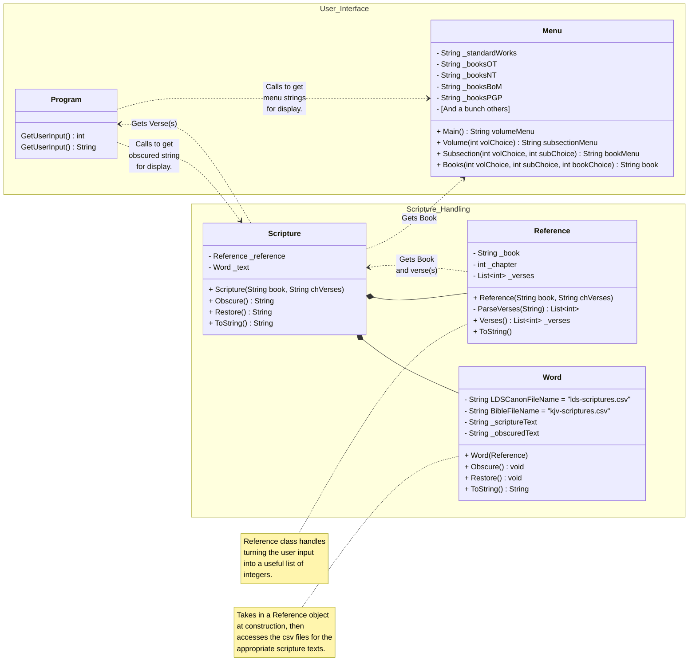

# README

## Assignment Details

Here are the pages associated with this assignment:

[Design Activity](https://byui-cse.github.io/cse210-course-2023/unit03/design.html)

[Program Requirements](https://byui-cse.github.io/cse210-course-2023/unit03/develop.html)

## Design

### Required Classes

- Scripture

  - Responsible for doing some fancy stuff

- Reference

  - Responsible for other stuff

- Word

  - Yet even more responsibilities.

### Class Diagram

My class diagram for this program

### IPO Table

| Input | Processing | Output |
| --- | --- | --- |
| From `Menu` class | Call display methods to return menu Strings and write to console  Get user input to move into deeper levels  (E.g. New Testament -> Romans -> Chapter number -> verse number(s)) | Display scripture selection menu with quit program option |
| (While in the main menu) `0` | Clear console, end loop | Terminate Program |
| Scripture Selection (Book, Chapter, Verses) | 1. Open CSV file  2. Return Scripture text  3. Format Strings for display  *Bonus Processing*  Count # of characters in each word as they come into the list.   As soon as a length of 30-40 characters has been exceeded, insert a linebreak into the String. | Display chosen verses as numbered paragraphs (as they appear in the scriptures) with the correct reference  *Bonus: Force paragraphs to stay under 30-40 characters wide without splitting in the middle of words* |
| `Enter` | `Console.WriteLine(<Scripture>.Obscure())` 1. Isolate words within the scripture text String (e.g. into a list)  2. Filter out already blanked-out words  3. Pick 3 unblanked indices at random  4. Blank those words, and reconstruct the String  5. Return formatted String (so it can be handed over to `Console.WriteLine()`| Show the same verse(s) with a few words replaced with blanks at random |
| `0` (or `Enter` if all words have been blanked out) | Clear console window, loop program | Return to scripture selection/quit out menu |
| *Optional Ideas:* | | |
| "Got it" or  "Didn't get it" | If (Got it) {`Word.HideWords()`}  Else If (Didn't Get it) {`Word.RestoreBlank()`  1. Pick a random blanked out spot from currently displayed String  2. Reference original scripture text to find the word to restore  3. Update display String  4. Call `Console.WriteLine(Word)` } | Proceed; remove 3 more words   Try again; restore 1 blanked out word |
