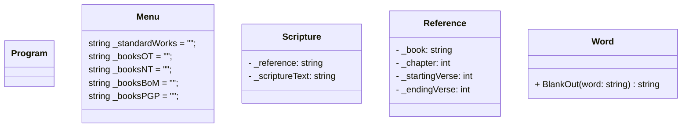

# README

## Assignment Details

Here are the pages associated with this assignment:

[Design Activity](https://byui-cse.github.io/cse210-course-2023/unit03/design.html)

[Program Requirements](https://byui-cse.github.io/cse210-course-2023/unit03/develop.html)

## Design

### Required Classes

- Scripture

- Reference

### Diagram

My class diagram for this program

