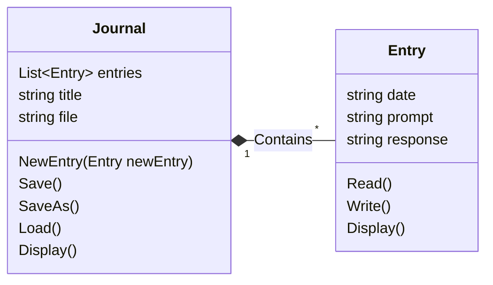

# Abstraction

## Instructions

Your response must:

- Explain the meaning of Abstraction
- Highlight a benefit of Abstraction
- Provide an application of Abstraction
- Use a code example of Abstraction from the program you wrote
- Thoroughly explain these concepts (this likely cannot be done in less than 100
words).

## Response

Abstraction is giving something complex a simpler representation, so that the
representation can be manipulated and worked with and understood, then applied
back to the source material. In the context of coding, one way to apply
abstraction involves laying out elements of code, for example on a whiteboard,
and figuring out how you want those elements to interact with each other before
you actually write any code.

This is beneficial because it allows you to solve a problem conceptually or
logically without being distracted by the medium in which you will eventually
execute your solution. Imagine you've been asked to give a conference in a
foreign country which doesn't speak english. Even if you speak the language of
that country, it's far easier and more practical to write out/plan your talk in
English, then translate it after it's complete. Trying to build a program
without abstracting it into a simpler form first would be like trying to write
your talk in a foreign language right from the get-go. It'd be much harder, and
you'd probably make some significant mistakes.

### Example

I previously wrote a journal writing program. I knew that at the very least I
would need a journal object, which itself would be made up of entry objects.



A simple diagram like the one above gives me an easy way to map out in my head
how the two objects should interact with each other, what they consist of, and
what they should be able to do. Then as I'm actually writing code, I can refer
to this diagram and others to make sure that what I'm writing conforms to the
design I already scoped out, like so:

#### Journal

```csharp
public class Journal
{
    public List<Entry> entries = new List<Entry>();
    public string title;
    ...

    public void NewEntry(Entry newEntry)
    {
        entries.Add(newEntry)
    };

    // Display
    public override string ToString()
    {
        // Make Title/Header:
        string header = $"{new string('=', 50)}\n
            {title}\n
            {entries.Count()} Entries\n
            {new string('='), 50}\n
        ";

        // Format entries for display:
        string entryBlock = "";
        int entryNumber = 1;
        foreach (Entry entry in entries)
        {
            entryBlock += $"{entryNumber} " + entry.ToString();
            entryBlock += $"\n{new string('-', 50)}\n";
            entryNumber ++;
        }

        // Final output:
        string display = header + entryBlock;
        return display;
    };
}
```

#### Entry

```csharp
public class Entry
{
    public string date;
    public string prompt;
    public string response;

    ...

    // Display
    public override string ToString()
    {
        return date + $"\n(Prompt: {prompt})\n" + response;
    };
}
```
